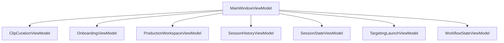

# Generated ViewModel Boundaries

Generated UTC: 2026-03-08 21:50:08

| Child ViewModel | Field |
|---|---|
| ClipCurationViewModel | _curation |
| OnboardingViewModel | _onboarding |
| ProductionWorkspaceViewModel | _production |
| SessionHistoryViewModel | _history |
| SessionStateViewModel | _sessionState |
| TargetingLaunchViewModel | _targeting |
| WorkflowStateViewModel | _workflow |
