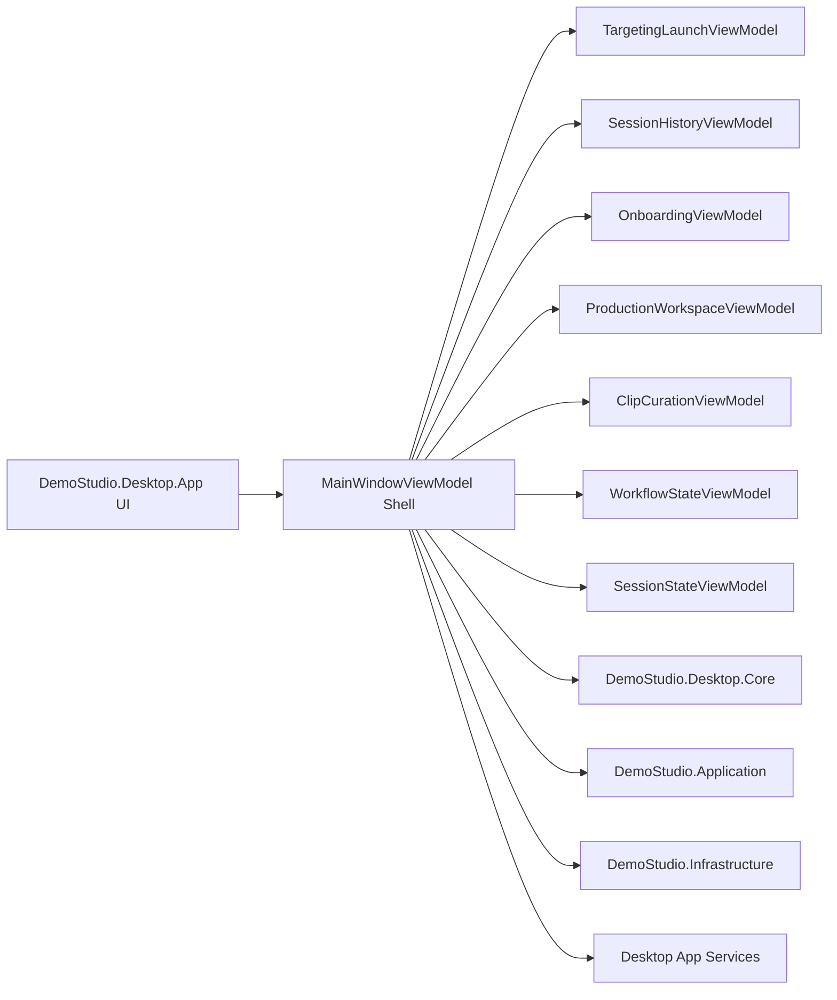

# Architecture Overview

```mermaid
flowchart LR
    UI[DemoStudio.Desktop.App UI] --> VM[MainWindowViewModel Shell]
    VM --> T[TargetingLaunchViewModel]
    VM --> H[SessionHistoryViewModel]
    VM --> O[OnboardingViewModel]
    VM --> P[ProductionWorkspaceViewModel]
    VM --> C[ClipCurationViewModel]
    VM --> W[WorkflowStateViewModel]
    VM --> S[SessionStateViewModel]

    VM --> CORE[DemoStudio.Desktop.Core]
    VM --> APP[DemoStudio.Application]
    VM --> INF[DemoStudio.Infrastructure]
    VM --> SRV[Desktop App Services]
```

This view is intentionally high-level. Generated current boundaries are in `docs/_generated/viewmodel-boundaries.md`.
