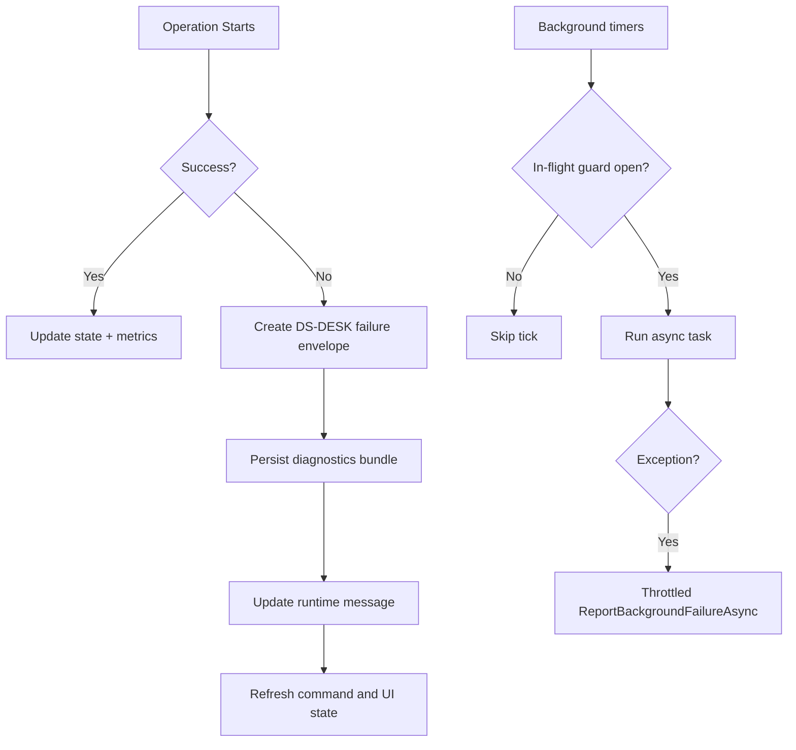

# Failure Handling

```mermaid
flowchart TD
    A[Operation Starts] --> B{Success?}
    B -- Yes --> C[Update state + metrics]
    B -- No --> D[Create DS-DESK failure envelope]
    D --> E[Persist diagnostics bundle]
    E --> F[Update runtime message]
    F --> G[Refresh command and UI state]

    H[Background timers] --> I{In-flight guard open?}
    I -- No --> J[Skip tick]
    I -- Yes --> K[Run async task]
    K --> L{Exception?}
    L -- Yes --> M[Throttled ReportBackgroundFailureAsync]
```

Primary objectives:
- Fail visibly with actionable diagnostics.
- Avoid repeated error storms.
- Keep UI responsive and state-consistent after failure paths.
