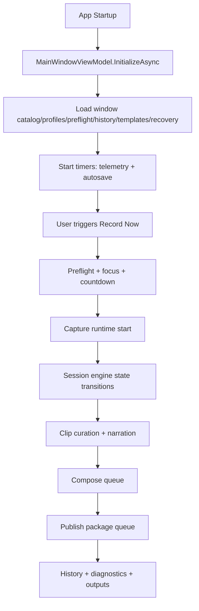

# Runtime Flow

```mermaid
flowchart TD
    A[App Startup] --> B[MainWindowViewModel.InitializeAsync]
    B --> C[Load window catalog/profiles/preflight/history/templates/recovery]
    C --> D[Start timers: telemetry + autosave]
    D --> E[User triggers Record Now]
    E --> F[Preflight + focus + countdown]
    F --> G[Capture runtime start]
    G --> H[Session engine state transitions]
    H --> I[Clip curation + narration]
    I --> J[Compose queue]
    J --> K[Publish package queue]
    K --> L[History + diagnostics + outputs]
```

This flow is stable by design: queueing and cancellation guards are used to reduce overlap and race conditions.
